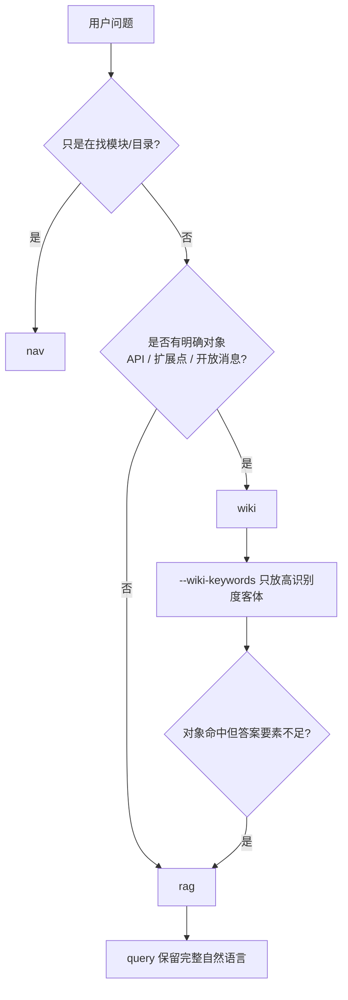

# YZY 有赞知识库查询

## 概述

结合文档目录导航、有赞云文档中心搜索接口和 wiki 关键词搜索接口，查询与用户问题相关的开放文档范围、内部知识库内容和 wiki 原文内容。当答案依赖有赞特定文档、内部实现、业务规则或定制需求背景时，优先查询知识库，不要凭通用经验猜测。

## 工作流程

1. 先判断问题主意图：模块定位问题、明确对象问题，还是普通语义问题。
2. 只看模块/目录时走 `nav`，用于先定位文档范围，不直接回答具体结论。
3. 只要问题中有明确 API、扩展点或开放消息对象，优先走 `wiki`，只提炼 1 个最高识别度客体，并通过 `--wiki-keywords 'kw1'` 显式传给脚本。
4. `wiki` 模式会并行补一次 `rag`，最终证据顺序以 rag 为主、按 score 排序，wiki 证据只放最后作为概念补充。
5. 其他非 `nav` 问题都走 `rag`，检索词保留完整自然语言表达；不要压成单个关键词。
6. wiki 搜索返回完整 `content` 时，脚本会按 Markdown 标题切片、按关键词打分、提取 `matchedSections` 和 `sourceExcerpt`，不要把完整 content 原样作为最终回答。
7. 优先使用脚本返回的 `sourceExcerpt` 回答具体字段、参数和规则问题。它来自 wiki 相关章节或显式开启的 Markdown 原文读取，避免因为搜索摘要截断而重复检索。
8. 先观察接口响应结构，再做总结。未知字段只能当作来源元信息，不要假设其业务含义。
9. 先基于检索结果给出结论，不要只贴接口 JSON。
10. 归纳关键依据；知识库、wiki 和目录导航结果用于支撑结论。
11. 回答接口、扩展点、消息、方案类问题时必须有据可循，优先引用原始链接；缺少链接的 wiki 或知识库结果只能作为弱依据。
12. 只基于返回的知识库内容、wiki 内容和目录导航回答，不编造三者没有返回的事实。
13. 首轮结果为空、报错或明显不相关时，可再执行一次更精确的查询；一次用户问题最多执行两次知识检索。
14. 结果仍然含糊或接口不可用时，明确说明，并建议用户补充信息，不要继续循环调用工具。
15. 如果响应中包含标题、URL、文档 ID、slug 或其他来源标识，回答时一并标注。

### 模式怎么选

- `rag`：普通语义问题、FAQ、流程、规则、原因、方案、操作步骤和概念解释时用。
- `wiki`：问题中有明确 API、扩展点或开放消息对象时优先用，并并行补一次 `rag`；最终以 rag 为主、按 score 排序，wiki 证据只作为补充。
- `nav`：问的是“有哪些目录、相关模块在哪里”这类范围探索问题时用。

简单判断规则：

1. 只是在找模块、目录、相关文档范围，选 `nav`。
2. 包含明确 API 名、扩展点名或开放消息名，选 `wiki`；字段名、错误码、报错、限制、怎么接入等只保留在 `query`，不要放进 `--wiki-keywords`。
3. 不包含明确 API / 扩展点 / 开放消息对象的普通问答，选 `rag`。
4. 首轮不要同时乱试多个模式；一次问题只选一个主模式，`wiki` 模式会自动并行补一次 `rag`。

示例：

| 用户问题 | 推荐模式 | 入参要点 |
| --- | --- | --- |
| `app开店是什么` | `rag` | `query="app开店是什么"`，保留完整问题 |
| `有赞云 API 服务费规则是什么` | `rag` | `query="有赞云API服务费规则"`；属于 FAQ/运营类时按标题式表达改写 |
| `youzan.item.add 的 sku_list 报错` | `wiki` | `query="youzan.item.add 的 sku_list 报错"`，`--wiki-keywords 'youzan.item.add'`；wiki 结果会并行补一次 `rag`，最终 rag 证据按 score 排序 |
| `youzan.item.add 怎么用` | `wiki` | `query="youzan.item.add 怎么用"`，`--wiki-keywords 'youzan.item.add'`；wiki 结果会并行补一次 `rag`，最终 rag 证据按 score 排序 |
| `youzan_scrm_MemberChangeSync 消息怎么订阅` | `wiki` | `query` 保留完整问题，`--wiki-keywords 'youzan_scrm_MemberChangeSync'`；wiki 结果会并行补一次 `rag`，最终 rag 证据按 score 排序 |
| `支付扩展点文档是哪一篇` | `wiki` | `query="支付扩展点"`，`--wiki-keywords '支付扩展点'` |
| `开放消息相关文档有哪些` | `nav` | `query="开放消息"`，先看目录和候选文档 |
| `第三方支付通道扩展点怎么接入，有哪些限制` | `wiki` | `query` 保留完整问题，`--wiki-keywords '第三方支付通道扩展点'`；wiki 结果会并行补一次 `rag`，最终 rag 证据按 score 排序 |

### 失败回退规则

1. `wiki` 首轮结果为空或明显不相关时，先检查是不是对象锚点过窄；如果对象明确，可更换 1 个最高识别度客体重试一次。
2. `wiki` 模式如果对象结果不足，会自动并行用 `rag` 补差，且 rag 证据始终排在 wiki 前面；不要把问题压成碎词。
3. `rag` 结果空而问题明显带 API、扩展点或开放消息对象时，再按对象补一次 `wiki`。
4. `nav` 首轮结果为空时，先放宽模块名到上级目录，再看候选文档。
5. 回退只做一轮，避免在 `nav` / `wiki` / `rag` 之间来回抖动。

## 入参关键词解析

这一节只适用于 `wiki`，或者用户明确要求精确按对象检索的场景；`rag` 直接保留完整自然语言问题，不做这类规整。

关键词规整应由调用 skill 的 Agent 负责，脚本只执行最终检索词。

解析规则：

- `--wiki-keywords` 只放 1 个高识别度客体，例如开放 API 名、扩展点名、消息名、文档名、产品能力名。
- 字段名、泛化动作词、问题状态词通常不进 `--wiki-keywords`，例如 `sku_list`、`报错`、`限制`、`怎么接入`；这些信息应保留在 `query`。
- 优先提取引号、反引号、书名号中的显式检索词。
- 保留接口路径、开放 API 名、类名、方法名、字段名、错误码、英文标识符等稳定 token；其中只有具备独立定位能力的 token 才放入 `--wiki-keywords`。
- 移除“帮我查一下”“知识库里有没有”“怎么处理”等检索话术。
- 保留有赞业务核心词，例如订单、商品、营销、优惠券、支付、退款、会员、店铺、库存、物流、开放 API、开放消息、扩展点、开发者、定制需求、集成方案等。
- 解析后的检索词过短或为空时，回退使用原始问题。
- 用户要求精确按输入查询时，直接把原始问题作为最终检索词。
- 如需留存原始问题，调用脚本时额外传入 `--original-query` 记录上下文。

## 内容有效性与时效判断

检索结果不是都能直接作为最终推荐方案，必须先做内容有效性筛选，并在同一章内处理输出内容和格式要求。

### 内容有效性规则

1. 如果结果中出现以下标记，不可作为最终推荐方案：
   - 已弃用
   - 已废弃
   - 已下线
   - 即将下线
   - 不推荐使用
   - 不推荐新接入使用
   - 仅历史兼容
   - 只维护不迭代
   - 不再维护
   - 请改用 xxx
   - 推荐使用 xxx
   - 已迁移至 xxx
   - 新接入开发者请使用 xxx
2. 如果结果明确给出了替代方案，应继续检索替代方案，并优先用替代方案文档回答。
3. 回答中的能力名称、接口名称、参数、示例、限制条件、操作步骤和参考文档，都必须以替代方案文档为准。
4. 历史兼容或背景说明可以简述，但不能作为新接入推荐。

### 公告时效规则

公告、通知、上线说明、变更通知、临时说明、活动说明、维护通知等内容，必须额外判断时效：

1. 默认只在发布时间起 2 个月内视为可作为当前结论依据。
2. 超过 2 个月且没有明确长期有效说明的公告，只能作为历史背景。
3. 当前问题必须依赖公告判断，但只检索到过期公告时，应继续查正式文档或更新说明。

### 输出内容要求

1. 回答中返回 `sourceUrl` 前必须先访问验证；只有 HTTP 状态为 2xx 时，才返回该 `sourceUrl`。
2. 默认面向人类输出归纳后的结论、操作步骤、关键依据和来源链接，不只返回接口原始 JSON。
3. 内部整理证据时，每条知识库结果必须尽量保留 `sourceType`、`sourceUrl`、`url`、`docId` 等来源字段；最终回答可按自然语言或列表呈现。
4. 缺少原始链接的条目只能作为弱依据，不能单独支撑关键结论；如引用此类条目，应明确说明缺少可验证链接。
5. 不要根据字段名猜测知识库未返回的事实；脚本只能抽取标题、摘要、类目路径、URL、文档 ID 等可见信息。

### 输出格式要求

1. 面向人类展示时，调用脚本使用 `--format pretty`，最终回答也默认使用自然语言、列表或表格等人类可读格式。
2. 只有用户明确要求 JSON、结构化输出、机器可读结果或需要沉淀为程序输入时，才输出归纳后的 JSON；JSON 中可包含 `originalQuery`、`usedQuery`、`conclusion`、`evidence`、`sources`、`traceability` 等字段。
3. 用户明确要求原始结果时使用 `--full-response`，在输出中附带完整接口响应。

## 脚本

统一使用 `scripts/search_knowledge.py`。它只做一件事：按工作流程选定的模式，把检索词和必要参数转成一次查询，并把结果整理成可直接回答的证据。脚本只接收最终检索词，不在代码里做关键词规整；关键词规整由 Agent 按上述规则完成。脚本默认返回 3 条结果，默认不读取 Markdown 原文；需要原文片段时再显式传 `--source-depth`。默认输出 JSON，便于 Agent 组合调用；遇到 HTTP 或 JSON 错误时以非 0 状态退出。内部服务响应慢时，使用 `--timeout <秒数>` 调整超时时间。

原文参数：

- `--source-depth <数量>`：读取前 N 条结果的 Markdown 原文，默认 0。
- `--source-timeout <秒数>`：单次原文请求超时，默认 5 秒。
- `--source-excerpt-limit <字符数>`：每条原文相关片段的最大字符数，默认 2500。
- `--no-source-hydration`：不读取 Markdown 原文，仅保留搜索摘要。

### `rag`

- 用于语义问题。
- `query` 保留完整自然语言表达，不压成单关键词。
- 常用参数：`--top-k`、`--timeout`、`--original-query`、`--no-source-hydration`、`--source-depth`、`--source-timeout`、`--source-excerpt-limit`。

### `wiki`

- 用于精确对象问题。
- `query` 保留对象名，额外传 `--wiki-keywords 'kw1'`。
- 常用参数：`--top-k`、`--wiki-limit`、`--wiki-section-limit`、`--timeout`、`--original-query`、`--no-source-hydration`、`--source-depth`、`--source-timeout`、`--source-excerpt-limit`。

### `nav`

- 用于目录探索，只看模块和候选文档。
- 常用参数：`--navigation-top-n`、`--navigation-module-depth`、`--navigation-url`、`--navigation-timeout`、`--no-navigation`。

### 常用参数

- `--top-k <数量>`：RAG 结果数量，默认 3。
- `--wiki-limit <数量>`：wiki 结果数量，默认 1。
- `--wiki-section-limit <数量>`：每条 wiki 结果保留的相关章节数量，默认 4。
- `--timeout <秒数>`：请求超时时间。
- `--no-navigation`：不读取 `llms.txt` 导航。
- `--navigation-top-n <数量>`：导航候选数量，默认 5。
- `--navigation-module-depth <数量>`：读取前几个模块的二级目录，默认 3。
- `--original-query`：保留用户原始问题。
- `--no-source-hydration`：不读取 Markdown 原文。
- `--source-depth <数量>`：读取前 N 条结果原文，默认 0。
- `--source-timeout <秒数>`：原文请求超时时间，默认 5 秒。
- `--source-excerpt-limit <字符数>`：原文片段最大长度，默认 2500。

### 输出与筛选

- 脚本默认输出 JSON，也支持 `--format pretty`。
- `wiki` 模式会整理 `matchedKeywords`、`matchedSections`、`sourceExcerpt` 和 `riskFlags`。
- `nav` 模式会返回目录模块、模块下的候选文档和追溯链接。
